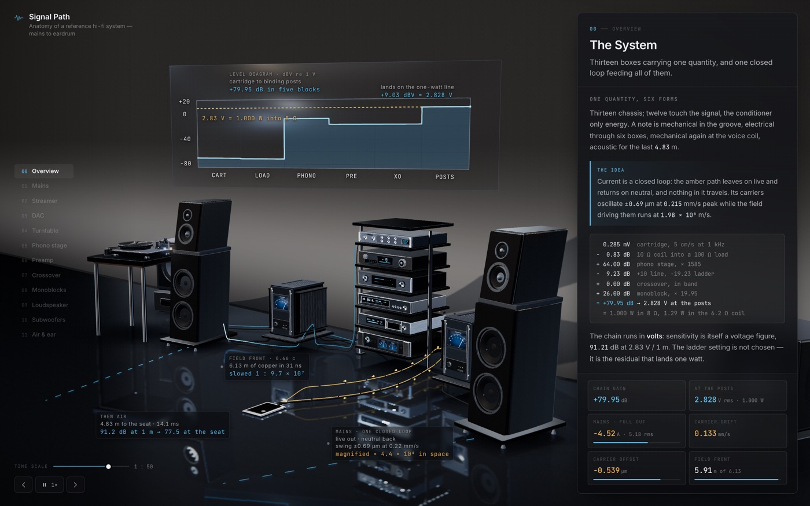
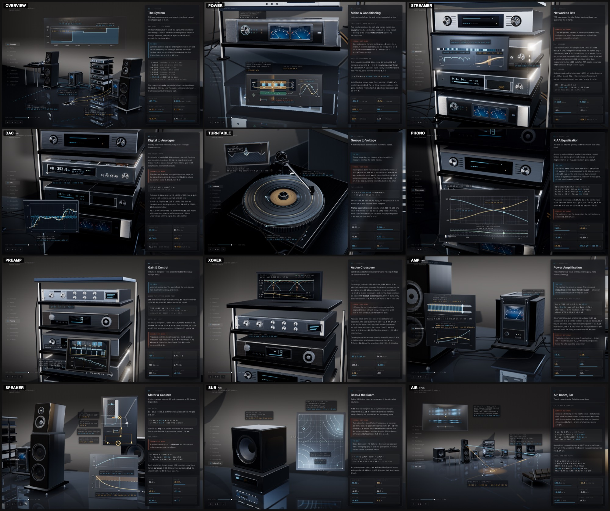
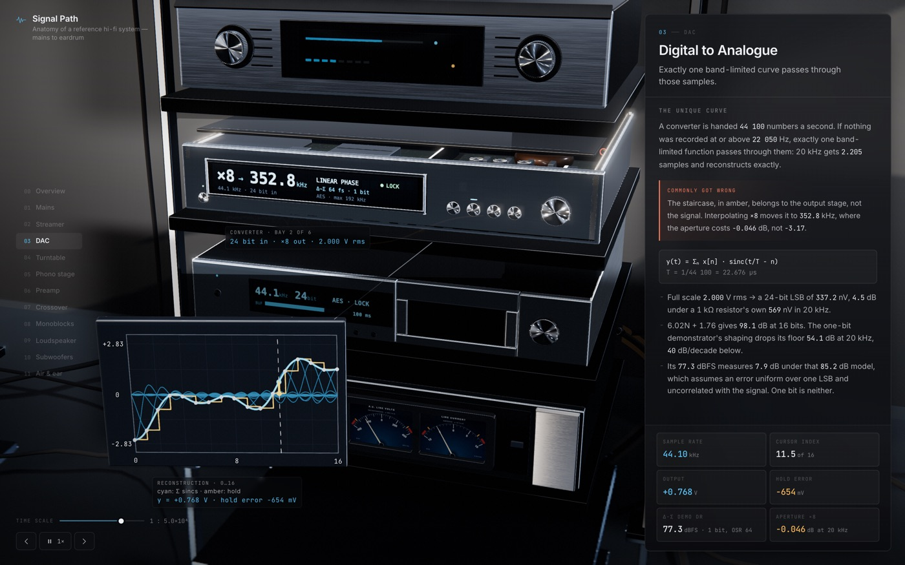
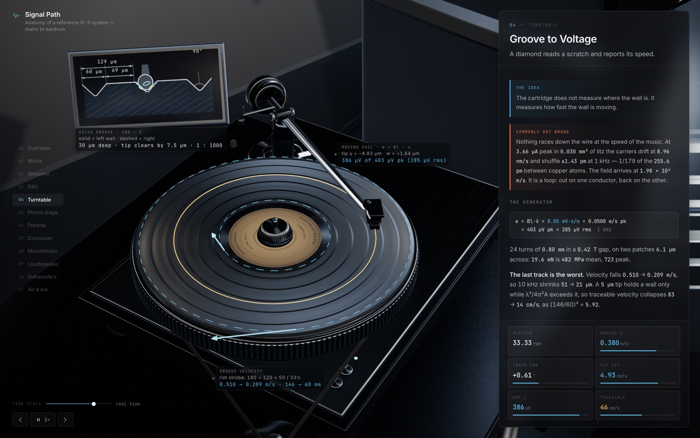

# Signal Path — earlier exhibit


An interactive, physically honest tour of a high-end component hi-fi system —
from mains electrons to air pressure at the eardrum. Twelve stages, one
self-contained HTML file, no external requests.

**[`hifi-system.html`](hifi-system.html)** — download it and open it in a
browser. That is the whole thing: Three.js, fonts, textures and all twelve
subsystems inlined into 1.2 MB.



---

## What it covers

| # | Stage | The idea |
|---|---|---|
| 00 | Overview | Thirteen chassis; twelve touch the signal, one touches only energy |
| 01 | Mains & conditioning | Nothing travels from the wall but a change in the field |
| 02 | Streamer | TCP guarantees the bits. Only a local oscillator guarantees the instants |
| 03 | DAC | Exactly one band-limited curve passes through those samples |
| 04 | Turntable | The cartridge does not measure where the wall is. It measures how fast it moves |
| 05 | Phono stage | A curve cut into the groove, and the network that takes it out |
| 06 | Preamp | Volume is not gain — it is a resistor ladder throwing voltage away |
| 07 | Active crossover | Split the band before the amplifiers, so no output stage carries another band |
| 08 | Monoblocks | The amplifier is a valve on the power supply, not a source of energy |
| 09 | Loudspeaker | A wire in a gap, pushing 49 g of cone against 30 litres of trapped air |
| 10 | Subwoofers | Below 90 Hz the room is a resonator, and it decides what you hear |
| 11 | Air, room, ear | The air never travels. Only the news does |

Use `←` `→` or the chapter rail to walk the signal path. Drag to orbit, scroll to
dolly, and the time-scale slider changes how fast the physics runs — the same
control spans 50 Hz mains, 44.1 kHz samples and a 2.8224 MHz one-bit stream.



---

## The rule that shaped it

> A beautiful lie is worse than an ugly truth.

Every number on screen is derived from stated inputs, not chosen to look good.
Three misconceptions are treated as hard failures and hunted for on every pass:

**Dots racing along a wire.** Electron drift in copper is ~10⁻⁴ m/s, and on AC
the carriers do not travel at all — they oscillate about a fixed point with a
peak displacement of order a micrometre, while the field carrying the energy
propagates at ~0.66 c. The mains chapter draws both, at their true ratio, with
the on-screen exaggeration factor for each printed on the drawing. It also
distinguishes the Fermi velocity (1.57 × 10⁶ m/s) from the classical thermal
figure most textbooks quote, and shows the random walk running 4.3 × 10⁴ times
further than the drift — in no particular direction.

**One-way current.** Current is a closed loop. Every circuit drawn shows its
return path: live and neutral, hot and black, coil lead out and coil lead back.

**The stair-step reconstruction myth.** Reconstruction is the sum of sinc
kernels through the samples, and it is the *unique* band-limited function that
passes through them. The staircase appears only in amber, explicitly labelled as
the zero-order hold the output stage physically emits, with its −3.92 dB
aperture droop at f<sub>s</sub>/2 and the reconstruction filter removing it.



---

## Verified arithmetic

`src/core/dsp.js` holds the maths; `src/core/spec.js` holds the system's
primaries so no two chapters can quote the same hardware differently. Both were
checked numerically rather than by eye:

- **Linkwitz–Riley 4th order** sums to `0.000000 dB` error across the band,
  −6.021 dB per leg at f<sub>c</sub>, both sections in phase. LR2 summed in
  positive polarity nulls at −46.7 dB, confirming it needs one driver inverted.
- **RIAA** record + playback sums to exactly flat; corners at 50.05 / 500.5 /
  2122 Hz from the 3180 / 318 / 75 µs time constants.
- **Δ-Σ modulator**, FFT-verified at OSR 64: order 1 puts in-band noise 38 dB
  below the out-of-band density, order 2 puts it 55 dB below. Order ≥ 3 is
  clamped, because an unscaled (1−z⁻¹)³ NTF has ‖NTF‖<sub>∞</sub> = 8 — far past
  Lee's rule for a one-bit quantiser — and measurably stops shaping at all.
- **Thiele–Small** closes from six measured primaries: Cms 659.37 µm/N,
  Qts 0.341, Vas 111.95 L, α 3.732, f<sub>c</sub> 60.91 Hz, Qtc 0.742,
  η₀ 0.647 %. The sealed box is correctly second order, 12 dB/octave.
- **The gain ladder** closes to `79.945882 dB` both ways — cartridge 284.6 µV,
  −0.828 dB loading loss, phono +64, line +10, ladder −19.23, monoblock +26 —
  landing 2.8284 V = 1.0000 W into 8 Ω.

Two sensitivities are kept distinct because they are not interchangeable:
90.11 dB at 1 W / 1 m, and 91.21 dB at 2.83 V / 1 m — 2.83 V is one watt into
8 Ω by definition but 1.29 W into this 6.2 Ω coil.



---

## Deploying

The site is a single self-contained file, so the "static site" is a directory
containing exactly one `index.html`. [`render.yaml`](render.yaml) declares it:

| setting | value |
|---|---|
| Build command | `npm ci && npm run build:legacy` |
| Publish directory | `./dist` |
| `PUPPETEER_SKIP_DOWNLOAD` | `true` |

That last one matters: `puppeteer` is a devDependency used only by the
screenshot harness, and without it the install pulls ~150 MB of Chromium the
build never touches.

Any static host works the same way — build, then serve `dist/`.

## Building

```bash
npm install
npm run build:legacy                  # → hifi-system.html and dist/index.html
npm run shoot                  # headless-Chrome screenshots of every stage
node shoot.mjs dac --w 2400    # one stage, custom size
node verify.mjs dac            # parallel-safe build + shoot for one stage
```

`build.mjs` bundles `src/main.js` with esbuild, then inlines the CSS and
base64 fonts into a single file. `shoot.mjs` renders each stage in headless
Chrome and fails on any console error, so a broken stage cannot ship quietly.

### Layout

```
src/
  main.js            app shell, stage lifecycle, render loop
  index.html         DOM: chapter rail, explanation panel, readouts
  app.css            the editorial type system
  core/
    spec.js          the system's primaries — one source of truth
    dsp.js           RIAA, Linkwitz-Riley, Thiele-Small, Δ-Σ, room modes
    env.js           procedural studio: softboxes, horizon band, flags
    reflector.js     planar floor reflection
    materials.js     anisotropic alloy, anodising, lacquer, cloth, vinyl
    geo.js           bevelled primitives, connectors, drivers, instrument glass
    diagram.js       Graph / Trace / Swarm — the shared diagram language
    labels.js        world-anchored DOM annotations with occlusion + keep-out
    layout.js        where everything physically is, and frameShot()
    room.js          floor, cyclorama, rack, stands, plinth, practicals
  stages/            twelve subsystem modules, one file each
CONTRACT.md          the module contract every stage is built against
```

Units are metres throughout; +X right, +Y up, −Z away from the listener.

---

## Notes and known gaps

- Both outer subwoofers fall outside the opening spread. Fitting 6.5 m of
  hardware into the clear stage area needs a 71° lens, which is wider than the
  piece allows; moving `LAYOUT.subL/subR` inboard to ≈ ±2.4 m would fix it.
- Driver cones are simplified. Modelled surrounds, baskets and phase plugs are
  the largest remaining step toward product-render quality.
- The `air` chapter's parcel animation is drawn at a compressed ratio. It is
  captioned, but the caption is doing work the drawing should.

Requires WebGL 2. Built with [Three.js](https://threejs.org) r180.
Type is Inter and JetBrains Mono, both SIL Open Font License.
