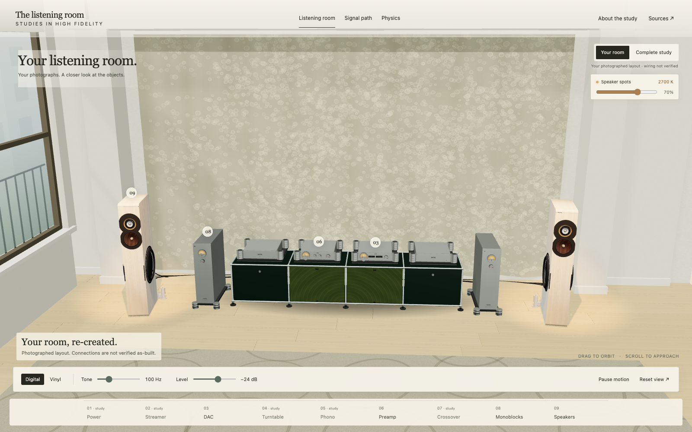

# The Listening Room

An interactive offline Three.js exhibit built around Boenicke W13 SE+ speakers, Nagra HD PREAMP, HD DAC X and Reference monoblocks. The photo-informed room includes the W13s' integrated active subwoofers, rear-inserted SwingBase supports and two dimmable 2700 K speaker spotlights.

**[Download the self-contained HTML](listening-room/The%20Listening%20Room.html)** to use it offline. Drag to orbit, select a component to inspect it, and use Physics or Connections to explore the science. The Sources drawer contains the embedded photographs and manufacturer references.



## Deploy to Render

`npm run build` (or `node deploy.mjs`) copies the committed, reviewed HTML to `dist/index.html` without modifying its bytes. Publish `dist/` as a static site. The existing `npm ci && npm run build` service command remains compatible; the blueprint uses `node deploy.mjs` because no dependency installation is needed to publish the embedded artifact.

## Rebuild after editing the exhibit

```sh
python3 listening-room/build.py
npm run build
```

The Python builder uses only the standard library and local assets. Commit the rebuilt `listening-room/The Listening Room.html` with source changes before deploying. The deployment step publishes that committed artifact so the hosted and downloadable versions match exactly.

[Usage, source layout and limitations](listening-room/README.md) · [Verification and independent reviews](listening-room/Verification.md)

The room and fine geometry are photo-informed estimates rather than factory CAD. The exhibit produces no audio and does not control equipment. Three.js and third-party reference image attribution are documented in the exhibit package.

## Earlier Signal Path version

The earlier app remains available as [hifi-system.html](hifi-system.html), with its [original documentation](LEGACY.md) and root `src/` retained. `npm run build:legacy` rebuilds that earlier version; it is not the default Render entry point.
